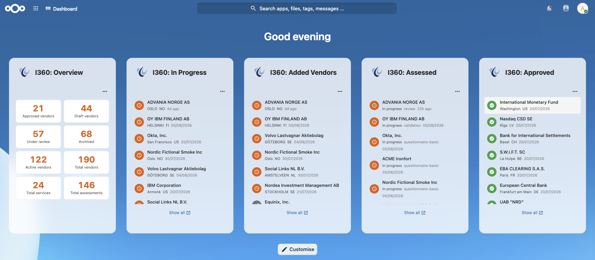

# Inspect360 integration for Nextcloud

[](https://github.com/njordium/integration_inspect360/actions/workflows/lint.yml)
[](https://github.com/njordium/integration_inspect360/releases)
[](COPYING)



> Njordium-authored Nextcloud integration for [Njordium Inspect360](https://njordium.com/products/inspect360/). Nextcloud **30 to 35**, PHP **8.3+**, Vue 3 / `@nextcloud/vue` v9, password-login → JWT-Bearer flow (OAuth 2.0 authorization-code planned upstream), five configurable dashboard widgets — an eight-tile KPI **Overview**, three vendor-lifecycle lists (**Approved**, **In Progress**, **Added Vendors**), and a recent **Assessed** feed. Per-widget refresh cadence, records-to-show, coloured status badges, relative-time meta, and every row deep-links back into ymir.

Bring the parts of Inspect360 that a governance, risk or compliance team checks ten times a day into the Nextcloud dashboard. Vendor pipeline state, recent assessments, KPI counts across the supplier lifecycle, and one-click deep links to the corresponding page inside Inspect360. All configurable per user, per widget.

## About Njordium Inspect360

[Njordium Inspect360](https://njordium.com/products/inspect360/) is Njordium's SaaS-hosted platform for **vendor risk management, compliance, and financial oversight** — positioned as *"One Platform for Vendor Risk, Compliance and Financial Oversight"* with the tagline *"Governance-led, risk-owned, compliance-driven."* It deploys on customer-controlled cloud or on-premise infrastructure, emphasising data sovereignty and no vendor lock-in.

Inspect360 targets enterprise governance, risk and compliance teams — Risk Managers, Compliance Officers, Vendor Managers, Internal Auditors and TPRM teams — and provides:

- Single assessment mapping to **NIS2, DORA, CRA, GDPR and ISO 27001** simultaneously.
- Supplier lifecycle management from onboarding through offboarding.
- 10×10 risk matrices tracking both inherent and residual risk.
- AI-powered automation including self-learning invoice extraction and automated vendor enrichment.
- Geographic risk intelligence with real-time heat maps.
- Integrated AML screening and financial anomaly detection.
- Enterprise-grade role-based access control with **8 specialised roles and 50+ granular permissions**.
- Real-time dashboards with role-specific KPI visibility.

Unlike typical GRC tools, Inspect360 positions governance, risk, and compliance as equal components rather than compliance-dominated systems. This Nextcloud integration surfaces Inspect360's supplier and assessment data on the dashboards your team already opens every day.

---

## Features

### Dashboard widgets

Five widgets, grouped by intent. Enable any subset via **Customise** on the Nextcloud dashboard.

**Overview** — one-glance summary

- **I360: Overview**. Eight KPI tiles in a compact 2×4 grid: Approved / Drafts / Under Review / Archived vendor counts, Active Vendors, Total Vendors, Total Services and Total Assessments. Each tile is clickable and deep-links to the equivalent Inspect360 filter page (`/vendors?status=approved` etc.). Backed by a single call to `/api/v1/suppliers/stats` plus a lightweight products count and an assessment-array count — one round-trip pair per refresh.

**Vendor pipeline** — where things stand

- **I360: Approved**. Suppliers with `status=approved`. Each row shows a green circular badge, organisation name, city · country, and the approval date (`approved_at`) as a relative timestamp. Regulatory flag chips (Critical / ICT / Data Processor / AML) appear where relevant.
- **I360: In Progress**. The Vendor Manager's workload — suppliers in **draft OR under_review**, sorted newest-first by `updated_at`. Colour badges automatically differentiate draft rows (grey pencil) from under-review rows (orange clock) in one list. Because the Inspect360 API does not support multi-status filtering in a single call, this endpoint fires two upstream calls and merges + sorts server-side.
- **I360: Added Vendors**. Recently added suppliers, most-recent first. Same row shape as Approved.

**Assessments** — what's moving

- **I360: Assessed**. Recent vendor assessments across the accessible suppliers, sorted by `updated_at desc` (client-side). Each row shows the supplier name, current status and stage (`current_screen`), a colour-coded risk chip (low = green / medium = orange / high = red / critical = dark-red), and the decision badge if one has been made.

Every widget carries a `⋯` menu top-right with **Widget settings** and **Refresh now** actions. Widget settings opens a modal with a per-widget **Refresh frequency** picker (Never / 30s / 1m / **5m default** / 15m / 30m / 1h) and, on the list widgets, a **Records to show** picker (5 / **10 default** / 20 / 50 / 100). Settings persist per user, per widget.

### Auto-refresh + tab-hidden pause

All widgets share a `useAutoRefresh` composable that sets a `setInterval` at the user-configured cadence, pauses when `document.visibilityState !== 'visible'`, and re-fetches on visibility change plus window focus. An idle dashboard tab left open in a background tab does not hammer Inspect360.

### Security

- **Password-login → JWT-Bearer interim** until Inspect360 exposes OAuth 2.0 authorization-code. The user's email and password are POSTed to `/api/v1/auth/login` over HTTPS; only the returned JWT refresh token is persisted, the password is discarded immediately.
- **Refresh token encrypted at rest** via Nextcloud's `ICrypto` (AES-256-CBC with the per-instance secret). Decryption failures return empty and force reconnect, never surface as errors.
- **Access tokens never persisted** — minted on demand from the refresh token and cached in a distributed cache (Redis / APCu / memcached) for `expires_in - 30 s` per user, so parallel dashboard-load requests coalesce to one refresh call instead of a thundering herd.
- **Bruteforce protection** via Nextcloud's `#[BruteForceProtection]` on `POST /login` — a session-authenticated user cannot use the Nextcloud instance to launder credential-stuffing traffic against Inspect360.
- **SSRF hardening on the admin `instance_url`** — cloud-metadata hostnames (`metadata.google.internal`, `169.254.169.254`, …) and any host that resolves to an RFC1918 / link-local / reserved IP range are rejected at admin-save time, independently of Nextcloud's `allow_local_remote_servers` flag. Loopback is deliberately allowed for dev.
- **MFA-enabled Inspect360 accounts return a targeted "not supported yet" message** rather than silently failing. Full MFA support arrives with OAuth 2.0 authorization-code.
- **Sensitive data redacted from logs** — tokens are stripped from log messages before write; upstream HTTP statuses are bucketed to `upstream_client_error` / `upstream_server_error` before the browser sees them.
- **Widget-key whitelist** on the per-widget preferences endpoint prevents authenticated users from populating `oc_preferences` with arbitrary rows.

Full OWASP Top 10 (2021) + API Security Top 10 (2023) mapping and audit history in [`SECURITY.md`](SECURITY.md).

---

## Requirements

- Nextcloud **30 – 35**
- **Njordium Inspect360** — any instance reachable from the Nextcloud host (default `https://ymir.njordium.io` for Njordium's demo tenant; on-prem / private-cloud instances configurable via the admin URL field)
- PHP **8.3+** (CI verifies syntax; PHPStan runs at level 5 against `nextcloud/ocp:dev-stable30`)
- Node **20+** and npm **10+** for building from source

---

## Installation

### From a git tag (recommended for pre-v1 deployments)

The current pre-v1 releases ship built JS bundles in the git tag, so a docker-hosted Nextcloud can deploy directly:

```bash
# First install
sudo -u www-data git clone https://github.com/njordium/integration_inspect360.git \
  /path/to/nextcloud/custom_apps/integration_inspect360
cd /path/to/nextcloud/custom_apps/integration_inspect360
sudo -u www-data git checkout v0.4.0
sudo chown -R www-data:www-data .
sudo -u www-data php occ upgrade
sudo -u www-data php occ app:enable integration_inspect360

# Subsequent upgrade — same, minus the clone and app:enable
sudo -u www-data git fetch --tags --force
sudo -u www-data git checkout v<next-tag>
sudo chown -R www-data:www-data .
sudo -u www-data php occ upgrade
```

### Manual install (source)

```bash
git clone https://github.com/njordium/integration_inspect360.git
cd integration_inspect360
composer install --no-dev
npm install
npm run build
# copy the tree to your Nextcloud's custom_apps/ then:
sudo -u www-data php occ app:enable integration_inspect360
```

### From the Nextcloud App Store

Not yet published — expected around v1.0.

---

## Configuration

### Admin

Once the app is enabled, an administrator sets the Inspect360 instance URL:

**Settings → Administration → Connected accounts → Inspect360 integration**

The default is `https://ymir.njordium.io` (Njordium's demo tenant), pre-populated as a placeholder so a fresh install works out of the box against demo. For production, replace with the URL of your Inspect360 instance. SSRF-hardened: cloud-metadata hostnames and private IPs are rejected; loopback is allowed for local dev.

### Per user

Each user connects their own Inspect360 account:

**Settings → Personal → Connected accounts → Inspect360 integration**

Enter your Inspect360 email and password → click **Sign in**. The password is not persisted — only the returned refresh token is stored (encrypted). You'll see **Connected as {email}** with your Inspect360 role chip when done. Click **Disconnect** at any time to revoke locally and best-effort revoke upstream.

### Widget settings (per user, per widget)

Open the `⋯` menu on any widget → **Widget settings** → **Refresh frequency** (Never / 30s / 1m / **5m default** / 15m / 30m / 1h) and, on list widgets, **Records to show** (5 / **10 default** / 20 / 50 / 100). One **Save** persists both fields.

---

## Development

Standard Nextcloud app layout.

```bash
# JS / Vue
npm install
npm run build       # production bundles into js/
npm run dev         # dev bundles
npm run watch       # rebuild on change
npm run lint        # eslint
npm run stylelint

# PHP
composer install
composer stan       # phpstan
composer test       # phpunit
```

Package for install with `make appstore` (or `make build`); see `makefile` for the full task list.

### Repository layout

- `appinfo/` — Nextcloud app metadata (`info.xml`, `routes.php`)
- `lib/AppInfo/` — DI bootstrap
- `lib/Controller/` — `ConfigController` (auth + admin config) + `Inspect360APIController` (widget-facing endpoints)
- `lib/Service/` — `Inspect360AuthService` (login / refresh / access-token lifecycle) + `Inspect360APIService` (thin HTTP wrapper) + `TokenStorage` (encrypted per-user refresh-token storage)
- `lib/Dashboard/` — one PHP `IWidget` class per widget
- `lib/Settings/` — `Admin` + `Personal` settings pages
- `src/views/` — one Vue file per widget content
- `src/components/` — shared Vue components (`WidgetSettingsModal`, `RefreshIntervalPicker`, `MaxItemsPicker`)
- `src/composables/` — shared Vue composables (`useAutoRefresh`)

---

## Contributing

Bug reports and pull requests welcome at [github.com/njordium/integration_inspect360](https://github.com/njordium/integration_inspect360). For security issues, please email `security@njordium.com` privately rather than opening a public issue — see [`SECURITY.md`](SECURITY.md).

---

## License

AGPL-3.0-or-later. See [`COPYING`](COPYING).
